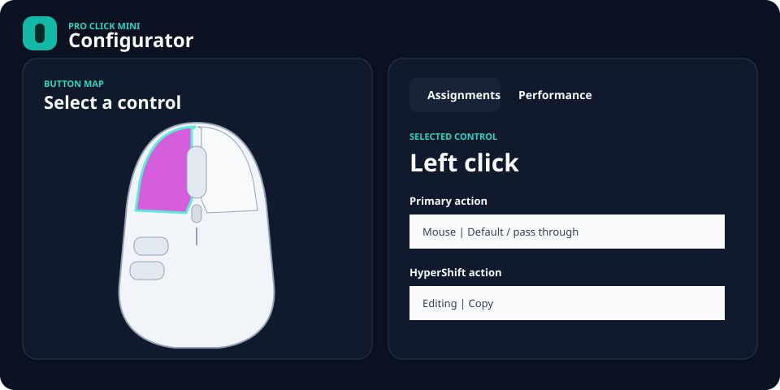

# Pro Click Mini Configurator

A lightweight, unofficial Windows configurator for the Razer Pro Click Mini.
It talks directly to the 2.4 GHz receiver for verified hardware settings and
onboard button assignments, including the HyperShift layer.



## Features

- Read and set DPI from 100 to 12,000.
- Configure one to five onboard DPI stages and the active stage.
- Select 125, 500, or 1,000 Hz polling.
- Read battery level and configure sleep time and the low-battery threshold.
- Read and assign seven onboard controls to common mouse, editing, navigation,
  Windows, and media actions.
- Read and configure the mouse's onboard HyperShift layer.
- Save assignments and settings as a readable local JSON profile.
- Use an original, clickable top-view mouse schematic; no Razer artwork is
  bundled.

## Important hardware boundary

Razer does not publish a Synapse CLI or a device-configuration API. The public
Chroma SDK controls lighting only, and the Pro Click Mini has no Chroma
lighting. This app therefore uses the receiver's HID feature-report protocol.

The receiver protocol exposes DPI, DPI stages, polling, battery, idle timeout,
low-battery threshold, firmware, and a ten-byte onboard assignment record. The
assignment command was verified directly against this receiver for all seven
controls on both the primary and HyperShift layers, including write/read-back.

| Setting | Saved to mouse | Saved locally | Requires app running |
| --- | :---: | :---: | :---: |
| DPI and DPI stages | Yes | Yes | No |
| Polling rate | Yes | Yes | No |
| Sleep and battery warning | Yes | Yes | No |
| Button assignments | Yes | Yes | No |
| HyperShift layer | Yes | Yes | No |

The **Apply to mouse** button writes performance, power, primary assignments,
and HyperShift assignments, then reads each setting back. **Save local profile**
also stores a backup in:

```text
%LOCALAPPDATA%\ProClickConfigurator\profile.json
```

## Requirements

- Windows 10 or Windows 11
- Razer Pro Click Mini connected through its 2.4 GHz receiver
- [.NET 8 Desktop Runtime](https://dotnet.microsoft.com/download/dotnet/8.0)

Bluetooth configuration is not implemented because no equivalent
vendor-feature interface has been verified for that mode.

## Build and run

From this directory:

```powershell
dotnet run --project .\src\ProClickConfigurator\ProClickConfigurator.csproj
```

Run the tests:

```powershell
dotnet test .\ProClickConfigurator.sln
```

Create a lightweight, framework-dependent single-file build:

```powershell
dotnet publish .\src\ProClickConfigurator\ProClickConfigurator.csproj `
  --configuration Release `
  --runtime win-x64 `
  --self-contained false `
  -p:PublishSingleFile=true `
  --output .\publish
```

## Using assignments and HyperShift

1. Click a numbered control on the mouse schematic.
2. Choose its primary and HyperShift actions.
3. Assign **HyperShift modifier** as the primary action of one pressable button.
4. Select **Apply to mouse** to write both layers to onboard memory.
5. Optionally save a local profile as a backup.

Select **Read from mouse** before editing to import the assignments currently
stored by Synapse or another configurator. If an onboard action is not in this
app's supported catalog, the app leaves all assignments untouched rather than
silently replacing it. Wheel tilt cannot be a held HyperShift modifier because
it is a momentary control.

If Synapse is running and a setting changes back, close Synapse before applying
the profile; both applications can compete for the same feature-report state.

## Research and implementation notes

See [docs/protocol.md](docs/protocol.md) for command details, sources, and the
distinction between verified behavior and unsupported Synapse functionality.

This project is not affiliated with or endorsed by Razer Inc. Razer, Synapse,
HyperShift, and Pro Click Mini are trademarks of their respective owner.
